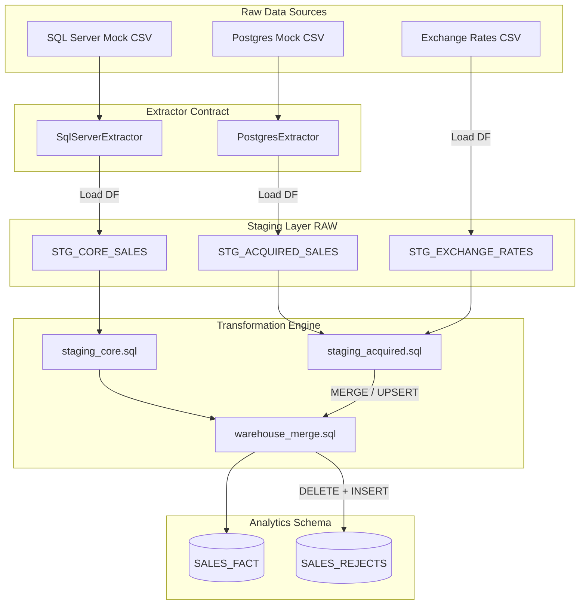

# Enterprise Data Integration Pipeline Documentation

This documentation provides an end-to-end overview of the Python + SQL ETL/ELT pipeline. It integrates core SQL Server sales data and acquired PostgreSQL sales data into a unified, clean Snowflake sales fact table and logging rejects table.

---

## 1. System Architecture

The pipeline follows an **ELT (Extract, Load, Transform)** design pattern:
1. **Extract**: Concrete extractors pull raw data from sources using pandas.
2. **Load**: Data is staged in raw tables in the warehouse (`STG_CORE_SALES`, `STG_ACQUIRED_SALES`, `STG_EXCHANGE_RATES`).
3. **Transform**: Snowflake-native SQL scripts clean, normalize currencies, validate, and merge records into the final warehouse fact (`SALES_FACT`) and rejects (`SALES_REJECTS`) tables.



---

## 2. Decoupled OOP Framework

The pipeline's Python modules are built on Object-Oriented Programming (OOP) contracts:

* **`BaseExtractor`** (`src/extractors/base_extractor.py`):
  * Abstract base class defining the extraction contract. Concrete classes `SqlServerExtractor` and `PostgresExtractor` inherit from it and implement the `extract()` method.
* **`DBEngine`** (`src/loaders/snowflake.py`):
  * Abstract database interface handling query execution (`execute`), dataframe fetching (`fetch_df`), and bulk data staging (`load_df`).
* **`DuckDBEngine`** (`src/loaders/snowflake.py`):
  * A local database simulator. Since live Snowflake credentials are not required for local development and testing, `DuckDBEngine` attaches an in-memory database and registers Python-implemented Snowflake functions (`TRY_PARSE_JSON`, `GET`, `TRY_TO_TIMESTAMP`) to execute Snowflake-native scripts locally.
* **`SnowflakeEngine`** (`src/loaders/snowflake.py`):
  * Direct production driver using `snowflake.connector` and `write_pandas` to load dataframes into Snowflake tables.
* **`StagingLoader`** (`src/loaders/staging.py`):
  * Manages schema instantiation (`RAW`, `ANALYTICS`) and handles columns staging/loading.
* **`SqlRunner`** (`src/transformers/sql_runner.py`):
  * Reads multi-statement SQL script files, runs queries sequentially, and captures performance and timing stats.

---

## 3. SQL Transformation & Normalization Logic

Transformations are configured native to Snowflake to optimize query execution and leverage warehouse performance:

* **Staging Core (SQL Server)** (`src/sql/staging_core.sql`):
  * Extracts nested JSON fields (`customer_id`, `customer_country`) from `customer_blob` via `GET(TRY_PARSE_JSON(...))`.
  * Standardizes timestamps using `TRY_TO_TIMESTAMP`.
  * Removes product prefixes like `PROD-` or `SKU-` using regular expressions.
  * Identifies validation rejects (invalid JSON blobs, duplicate transaction records, missing product SKUs).
* **Staging Acquired (Postgres)** (`src/sql/staging_acquired.sql`):
  * Handles mixed timestamp formats (`YYYY-MM-DD HH:MI:SS`, `DD/MM/YYYY HH:MI:SS`, `YYYY/MM/DD HH:MI:SS`) by coalescing multiple `TRY_TO_TIMESTAMP` patterns.
  * Adjusts transaction currencies using a `LEFT JOIN` on `STG_EXCHANGE_RATES` to normalize all raw amounts into `USD`.
  * Identifies rejects (unknown currencies, missing product SKUs, duplicate transaction IDs).
* **Warehouse Merge** (`src/sql/warehouse_merge.sql`):
  * Integrates staged records into `SALES_FACT` and `SALES_REJECTS`.

---

## 4. Production-Ready Enhancements

### I. Logging & Observability
We replaced print statements with the standard `logging` module to print formatted logs:
* **Human-Readable Format**: A default clean console style for development (`%(asctime)s [%(levelname)s] %(name)s: %(message)s`).
* **Structured Production Format**: A `--json-logs` CLI flag format that outputs line-delimited JSON objects to standard output. This makes logs directly parseable by logging daemons (like Fluentd, Logstash, or Datadog):
  ```json
  {"timestamp": "2026-06-27 20:40:17,122", "level": "INFO", "logger": "main", "message": "Starting Enterprise Data Integration Pipeline..."}
  ```

### II. Error Handling & Boundaries
* Added robust `try-except` blocks around file readers, SQL runner script execution, and DB drivers.
* Detailed traceback context is printed using `exc_info=True` to speed up remote diagnostics while clean exceptions are re-raised to guarantee the scheduling orchestrator (like Airflow or Prefect) marks the job run as failed if an error occurs.

### III. Transient Error Resiliency (Retries)
* Implemented a custom `@retry` decorator in `src/loaders/snowflake.py` supporting exponential backoff and randomized delay jitter.
* Applied it to `SnowflakeEngine` network/connection entrypoints (`_connect`, `execute`, `fetch_df`, `load_df`) to handle transient database connectivity issues (e.g. gateways drops, transient timeouts) cleanly without aborting the entire job run immediately.

---

## 5. Technical Discussion Q&A Preparation

### 1. How does the design satisfy idempotency, incremental loading, and data quality checks?
* **Idempotency**: 
  * The sales fact tables are loaded using a SQL `MERGE` query matching on a generated `warehouse_transaction_id` (prefixed with `source_system` to ensure unique constraints). Repeated runs update changes in-place without adding duplicates.
  * For the rejects log, incoming transaction ids for the current batch are deleted from `SALES_REJECTS` before insertion, avoiding double logging of validation errors on subsequent runs.
* **Incremental Loading**:
  * The architecture stages raw batches, then performs `MERGE` actions downstream. Watermark controls can filter source files or source database tables by querying `max(checkout_timestamp)` from the target fact table.
* **Data Quality Checks**:
  * Performed native to the database during staging. Transactions with parsing issues (invalid JSON, missing SKU, unknown exchange rate, duplicate transaction IDs) are flagged with a specific `reject_reason` and loaded to the rejects log. Clean rows are written to the fact table.

### 2. How are database credentials handled?
* Credentials (like Snowflake passwords) are stored as environment variables on the OS and referenced in `config/dummy.yml` using `${VAR}` notation.
* The YAML config reader expands these environment variables at runtime.
* Secrets are never hardcoded or committed to git, and credentials are not required for local development and test runs (which use DuckDB).

### 3. How would your approach change for 100 million rows instead of these CSVs?
* **Ingestion**: We would avoid loading data in memory using Pandas dataframes. Instead, extractors would stream data in chunks or write directly to cloud storage (Amazon S3, Azure Blob, GCS) using bulk unload commands (like `pg_dump` or `bcp`).
* **Loading**: We would upload files to an external cloud stage using Snowflake's `PUT` statement, then load them in parallel using optimized `COPY INTO` instructions.
* **SQL Transformations**: View definitions would be materialized as transient or staging tables to prevent CPU spikes in staging query paths during warehouse runs.

### 4. Why use an abstract `BaseExtractor` instead of just functions?
* **Interface Guarantees**: Enforces a strict signature contract (`extract() -> pd.DataFrame`) across all extractors.
* **Extensibility (Open-Closed Principle)**: If a new source system (e.g. an API or MongoDB source) is added, we write a new concrete class subclassing `BaseExtractor` without changing any orchestrator code in `main.py`.
* **Testing Decoupling**: Simplifies swapping production database extractors for local CSV mock extractors.

### 5. Snowflake Ingestion: Would you use row inserts, PUT/Stage/COPY INTO, Snowpipe, or external stages?
* **Avoid Row-by-Row Inserts**: Highly inefficient on OLAP column-oriented databases that optimize for bulk micro-partitions.
* **For Batch Pipelines at Scale (PUT/Stage/COPY INTO)**: The industry standard. Data is written to compressed files (like Parquet/CSV), uploaded to a secure stage, and imported into Snowflake.
* **For Continuous Streaming (Snowpipe)**: Listens to S3 bucket upload notifications (via SQS/SNS) to copy files in micro-batches immediately as they arrive, optimizing compute resource scheduling.
